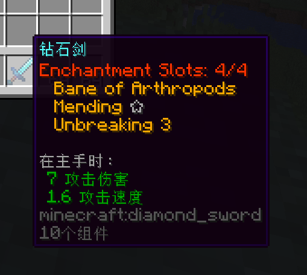

# 🔴Custom Enchantment Used Slot

You can set custom enchantment used slot at `config.yml` file.

Here is an example:

```yaml
# Enchant Used Slot
enchant-used-slot:
  values:
    mending: 2
  placeholder:
    0: '&c☆'
    1: ''
    2: '&7☆'
    3: '&f☆'
    4: '&e☆'
    5: '&6☆'
```

This means `mending` will use **2** slots instead of only one by default.

<figure><figcaption></figcaption></figure>
