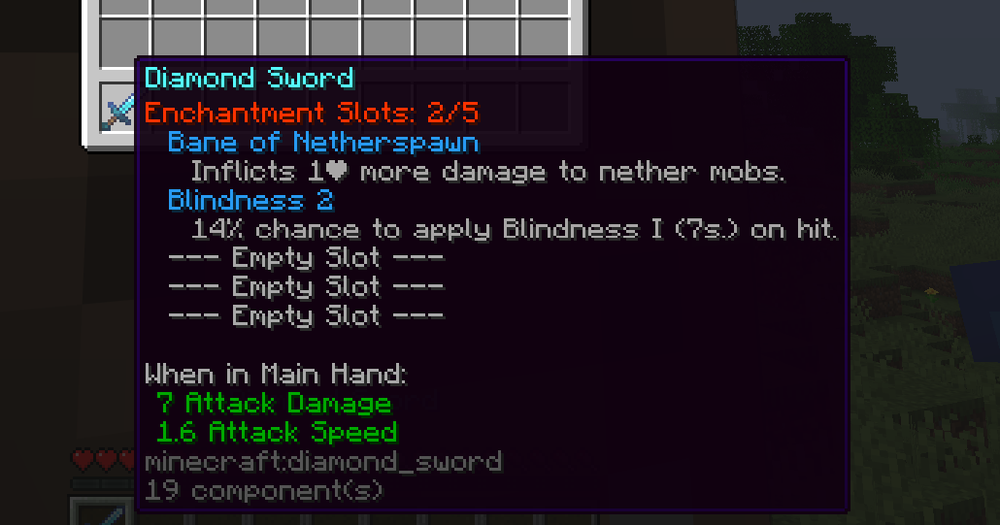

# ❓FAQ

## Q: Can I display enchantment description in enchantment slot lore? <a href="#why-all-my-enchantments-are-english-or-seems-a-id" id="why-all-my-enchantments-are-english-or-seems-a-id"></a>

A:

Open `config.yml` file and find those content:

```yaml
    placeholder:
      auto-parse: true
      enchants:
        # Other placeholder: {enchant_level_roman}, {enchant_raw_name}, {enchant_used_slot}, {enchant_description}
        format: '{lang}'
        sort: true
        auto-add-space: true
        level-hide-one: true
        description:
          # Requires supported third-party enchantment plugin, such as EcoEnchants.
          # Disabled by default. If no supported plugin is installed, this feature does nothing.
          enabled: true # Set this to true.
```

Check `settings.add-lore.placeholder.enchants.description.enabled` option in `config.yml` file. Default to `false`, if you want to display enchantment description from [supported custom enchantment plugins](compatibility.md), you can try set it to true. Showcase:

<figure><figcaption></figcaption></figure>

## Q: I installed multi server sync plugin like HuskSync and sometimes my enchantments get lost. <a href="#why-all-my-enchantments-are-english-or-seems-a-id" id="why-all-my-enchantments-are-english-or-seems-a-id"></a>

A:

Open `config.yml` file and find those content:

```yaml
    SetSlotPacket:
      enabled: true
      # Only plugin has enchantment slot NBT will be checked.
      remove-illegal-excess-enchant:
        enabled: true 
        hide-remove-message: false 
        ignore-join-time: -1
        run-sync: true
```

Please change `ignore-join-time` option to **5 (or a number greater than 5)**, and then change `run-sync` option to `true`.

If this does not work for you, the best way is disable remove illegal excess enchant feature by change `enabled` option to `false`.

## Q: Seems that my item does not have enchantment slot lore added! <a href="#why-all-my-enchantments-are-english-or-seems-a-id" id="why-all-my-enchantments-are-english-or-seems-a-id"></a>

A:&#x20;

* Check whether you have installed the packet listener plugin you set in `config.yml`. If yes, then please check whether that plugin is worked in your server.
* Check whether you have other plugin also try to modify this item's lore. The best way to test this is delete all plugins except for EnchantmentSlots and your packet listener plugin.
* Usually, that because you didn't set default slot setting for this item. Try hold the item in survival mode and use command `/es setslots 5`, if the lore display after that, this just because your slot setting missing.
* Check your config file, your `config.yml` maybe has wrong format, try regenerate config file.
* Don't drag item from creaative inventory, please keep your game mode into survival, and try use /give command, crafting and other ways to gain items.
* There is auto-add-lore option in config.yml, if all of those above does not work for you, try to enable this option.

## Q: Why all my enchantments are English or seems a ID? <a href="#why-all-my-enchantments-are-english-or-seems-a-id" id="why-all-my-enchantments-are-english-or-seems-a-id"></a>

A: You should set enchantment name at the plugin `config.yml`'s `enchant-name` section.

## Q: Does enchantment lore order be changed in item lore?

A: If you EnchantmentSlots auto add lore for those items, it can only at first or last of item lore, or you use our [item placeholder](../features/item-placeholder.md) into your item lore.

## Q: How to hide enchantment slot lore?

A: Please view [this page](../general-configs/add-lore.md).

## Q: How to display enchantment description from other plugins?

A:

* Remove `{enchants}` placeholder use in `settings -> add-lore -> display-value` option at `config.yml` file. (or your language file if you are setting `{lang}` here)
* Set `auto-hide-enchants` option value to false in your each slot settings configs.
* If not work, my answer is I don't know either.
